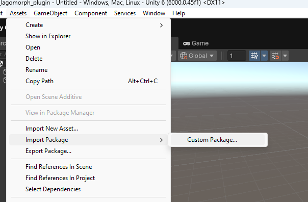
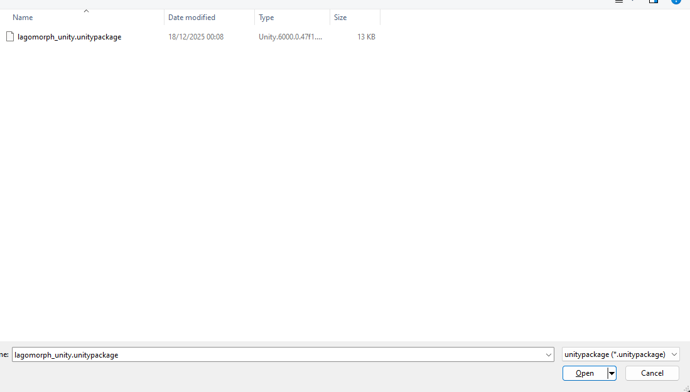
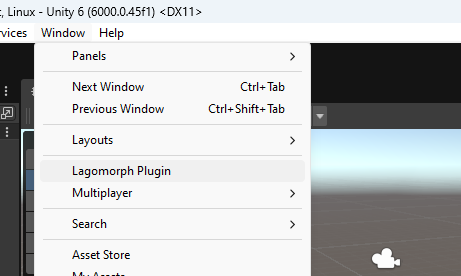

# Lagomorph AI Plugin for Unity

**AI-driven 3D art generation directly in your Unity workflow. Create game-ready models from text and images in minutes.**

[Download Plugin](https://github.com/LagomorphAI/unity-engine-plugin-release) | [Join Community](https://discord.gg/RsNwwy3WCc)

---

## Overview

Lagomorph AI empowers game developers with AI-driven 3D model generation. Generate game-ready assets directly within Unity using natural language or reference images, dramatically reducing iteration time from concept to implementation.

### Key Features

**Text to 3D Generation**
Describe models in natural language and generate game-ready assets instantly.

**Image to 3D Conversion**
Upload concept art and transform it into fully realized 3D models.

**Automatic Texturing**
Generate high-quality materials and textures automatically.

**Game-Ready Output**
Optimized for real-time rendering with clean topology and efficient UV layouts.

## Installation

### Prerequisites

- Unity 6.x or higher
- Active internet connection for AI processing
- Minimum 8GB RAM (recommended)
- Windows operating system

### Installation Steps

#### Step 1: Download the Plugin

Visit the [Fab store](https://github.com/LagomorphAI/unity-engine-plugin-release)

#### Step 2: Import the Plugin


    

#### Step 3: Restart Unity

Close and restart Unity. The plugin will be automatically detected and loaded when the engine starts.

#### Step 4: Launch the Plugin

Open the **Windows** menu in Unity and select **Lagomorph Plugin** to launch the interface.


This will launch the Lagomorph Editor Window


> ✅ **Installation Complete**
> 
> You're now ready to start generating 3D models with Lagomorph AI. The plugin interface will appear as a dockable window in your Unity editor.

---

## Quick Start Guide

Let's create your first AI-generated 3D model. This quick start will walk you through the basic workflow.

### Creating Your First Model

1. Open the Lagomorph Plugin from the Tools menu
2. Enter a description of your desired model (e.g., "a medieval stone fountain")
3. Click the "Morph!" button to begin generation
4. Wait for the AI to process (typically 2-5 minutes)
5. Review the generated results and import to your scene

> ⏱️ **Processing Time**
> 
> Generation time varies based on complexity and server load. Feel free to continue working on other aspects of your project while waiting. You'll receive a notification when your model is ready.

---

## Text to 3D Generation

Transform natural language descriptions into fully realized 3D models. This feature is ideal for rapid prototyping and exploring design variations.

### Writing Effective Prompts

The quality of your generated models depends heavily on the clarity and specificity of your prompts.

#### Be Specific

Instead of: "a sword"

Try: "a medieval longsword with ornate crossguard and leather-wrapped handle"

#### Include Style Direction

```
"a cartoon-style submarine with rounded edges and bright colors"
"a photorealistic vintage radio with brass dials and wooden cabinet"
"a low-poly stylized tree suitable for mobile games"
```

#### Specify Materials

```
"a rusty iron gate with peeling paint"
"a polished marble statue"
"a wooden barrel with metal bands"
```

### Example Prompts

| Category | Example Prompt | Use Case |
|----------|---------------|----------|
| Props | "a Victorian street lamp with ornate metalwork" | Environment decoration |
| Weapons | "a futuristic energy rifle with glowing blue accents" | Player equipment |
| Vehicles | "a military helicopter with camouflage paint" | Transportation |
| Architecture | "a medieval stone well with wooden bucket" | Level design |

---

## Image to 3D Conversion

Upload reference images or concept art to guide the AI's generation process. This feature is perfect when you have a visual reference but need a 3D implementation.

### Supported Image Formats

- JPEG (.jpg, .jpeg)
- PNG (.png)
- TGA (.tga)
- BMP (.bmp)

### Best Practices for Reference Images

- Use high-resolution images (minimum 1024x1024 recommended)
- Ensure good lighting and clear details
- Provide multiple angles when possible
- Avoid images with complex backgrounds

> ⚠️ **Image Quality Matters**
> 
> The quality and clarity of your reference images directly impact the quality of generated models. Blurry or low-resolution images may produce less detailed results.

---

## Materials & Textures

Lagomorph AI can automatically generate materials and textures for your models, or you can apply textures to existing geometry.

### Automatic Texture Generation

After your model is generated, you have the option to request automatic texture generation. The AI will analyze the geometry and create appropriate materials based on your original prompt or reference images.

### Texture Options

- **Generate with Model:** Textures are created simultaneously with geometry
- **Generate After Review:** Review the mesh first, then request textures
- **Skip Textures:** Import geometry only for manual texturing

### Material Properties

Generated materials include:

- Base Color / Albedo maps
- Normal maps for surface detail
- Roughness maps
- Metallic maps (when appropriate)

---

## Complete Workflow

Here's a comprehensive overview of the typical Lagomorph AI workflow from concept to implementation.

### 1. Define Your Requirements

Start by clearly defining what you need. Write a detailed text prompt or gather reference images. Consider the style, materials, and level of detail required for your project.

### 2. Generate the Model

Input your prompt or upload reference images in the Lagomorph plugin interface. Click "Morph!" to begin the generation process. The AI will process your request, which typically takes 2-5 minutes depending on complexity and server load.

### 3. Review Results

Once generation is complete, review the results. Lagomorph often generates multiple variations for you to choose from. Examine the geometry, proportions, and overall quality.

### 4. Generate Materials (Optional)

If you're satisfied with the mesh, you can request automatic material and texture generation. This adds realistic surface properties to your model.

### 5. Import to Project

Import your chosen model directly into your Unity project. The asset will appear in your Content Browser, ready to be placed in your scenes.

### 6. Iterate and Refine

If the result isn't quite right, try morphing again with adjusted prompts or different reference images. You can generate multiple variations to find the perfect fit for your game.

---

## Best Practices

Maximize your results with these proven strategies for using Lagomorph AI effectively.

### Prompt Engineering

- Start with broad descriptions, then add specific details
- Include material descriptions (wood, metal, stone, etc.)
- Specify artistic style (realistic, cartoon, low-poly, etc.)
- Mention scale or size when relevant
- Use adjectives to convey mood and atmosphere

### Iteration Strategy

- Generate multiple variations by morphing the same prompt several times
- Start with simpler objects before tackling complex assemblies
- Use successful generations as reference for similar objects
- Keep track of effective prompts for future use

### Performance Optimization

- Queue multiple morphs at once to work in parallel
- Continue other development tasks while waiting for results
- Consider generating variations during breaks or overnight
- Organize generated assets with clear naming conventions

---

## Tips & Tricks

> 💡 **Pro Tip: Batch Generation**
> 
> Generate multiple variations of the same object simultaneously. This gives you more options to choose from and helps identify the most effective prompts.

### Common Workflows

#### Rapid Prototyping

Use Lagomorph to quickly populate your levels with placeholder assets. Generate variations of props, furniture, and environmental objects to establish the visual direction before final asset production.

#### Concept Exploration

Experiment with different visual styles by generating the same object with varied style descriptions. Compare results to inform your game's art direction.

#### Reference Generation

Create reference models for your art team. Use Lagomorph to explore proportions, silhouettes, and design variations that can guide manual modeling efforts.

---

## Example Gallery

Here are some examples of models generated with Lagomorph AI to inspire your own creations:

### Suit of Armour
**Prompt:** "medieval plate armor with ornate engravings"

### Chef Knife
**Prompt:** "professional chef's knife with wooden handle"

### Helicopter
**Prompt:** "military attack helicopter with weapons systems"

### Victorian Street Lamp
**Prompt:** "ornate Victorian street lamp with gas light fixture"

### Magic Staff
**Prompt:** "fantasy wizard staff with glowing crystal top"

### Warship
**Prompt:** "detailed naval warship with gun turrets"

---

## Troubleshooting

### Plugin Not Appearing in Tools Menu

- Verify the plugin is installed in the correct Plugins folder
- Ensure you've restarted Unity after installation
- Check the Plugins window (Edit → Plugins) to confirm Lagomorph is enabled

### Generation Taking Too Long

- Check your internet connection
- Server load may be high during peak hours - try again later
- Complex prompts naturally take longer to process

### Unexpected Results

- Refine your prompt to be more specific
- Try adding style keywords (realistic, stylized, low-poly, etc.)
- Use reference images in addition to text prompts
- Generate multiple variations to see different interpretations

### Import Errors

- Ensure you have write permissions in your Content folder
- Verify sufficient disk space for asset import
- Check Unity's Output Log for specific error messages

---

## Support

Need help or have questions? We're here to assist!

- **Email:** [hello@lagomorph.ai](mailto:hello@lagomorph.ai)
- **Discord Community:** [Join our Discord](https://discord.gg/RsNwwy3WCc)
- **Documentation:** [https://docs.lagomorph.ai](https://docs.lagomorph.ai)

> **Missing your favourite tool?**
> 
> We want to make sure you can run Lagomorph on all your favourite platforms. Let us know where we should go next by emailing us or joining our Discord community!

---

## Additional Resources

---

*© Lagomorph AI 2025 • All rights reserved*